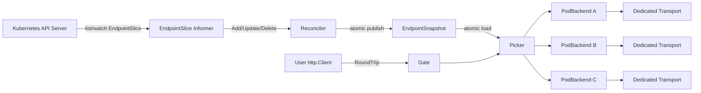

> [简体中文](./technical-design.zh.md)

# gokubegate Technical Design

## Document status

- Status: Draft v0.1
- Date: 2026-08-29
- Scope: gokubegate v0.1 core library (in-cluster client-side load balancing)
- This document is a technical design; it does not imply that the features are implemented

## 1. Background and motivation

Kubernetes Service ClusterIP load balancing happens at L4: **an endpoint is chosen only when a TCP connection is established**. Go's `net/http.Transport` prefers to reuse existing keep-alive connections, so when an in-cluster Go service calls another service, requests tend to concentrate on a small number of Pods for a long time. HTTP/2's single-connection multiplexing further amplifies this connection-level stickiness.

This connection-level stickiness has caused forwarding timeouts in production gateways. The mitigations the team previously validated:

- Larger connection pools, longer idle timeouts, smaller buffers — reduce connection-establishment pressure;
- A low rate of random `Connection: close` rotation — reduce sticking to stale endpoints.

These mitigations only **improve the probability distribution**; they cannot guarantee per-request load balancing across the currently Ready Pods. The final approach is client-side, per-Pod load balancing based on `EndpointSlice`: pick a Pod before the request, dial the Pod address directly, and keep a dedicated connection pool per Pod.

**gokubegate's goal is to extract this validated capability into a generic, out-of-the-box Go client library.** Any Go service running inside a cluster can get client-level load balancing with a few lines of code, without understanding informers, connection pools, drain, and similar details.

## 2. Goals

1. Expose a minimal API: `gokubegate.NewClient(ctx, namespace, service, opts...)` returning a ready-to-use `*http.Client` wrapper.
2. Automatically handle: EndpointSlice discovery, Ready/terminating filtering, client-side load balancing, a dedicated connection pool per Pod, and Pod addition/removal.
3. Be fully compatible with the standard library `net/http` (the core is an `http.RoundTripper`); ordinary requests, SSE streaming, and long requests all work.
4. Work out of the box with zero configuration by default; all necessary customization goes through optional parameters (functional options).
5. Graceful lifecycle: wait for informer cache sync at startup, gracefully drain in-flight requests on close.
6. When the Kubernetes API server is briefly unavailable, keep forwarding from the last-known-good snapshot without interrupting traffic.
7. Observability: an event hook mechanism; users implement metrics/tracing/auditing themselves. Zero collection and zero logging dependencies by default.
8. One `Client` maps to one downstream Service; for multiple services, users compose multiple `Client`s rather than using implicit aggregation.

## 3. Non-goals (not included in v0.1)

- **No automatic cross-Pod retries**: requests such as POST cannot be replayed safely; automatic retries cause duplicate writes and fault amplification. Only keep `net/http.Transport`'s own limited retries for safe conditions.
- No adaptive weights, EWMA, circuit breaking, or complex unhealthy-instance eviction.
- No HTTP/2 multiplexing enabled; the architecture must still allow per-Pod HTTP/2 in the future.
- No Service Mesh mTLS/sidecar integration details (the document provides constraints and hints).
- Does not replace the Kubernetes readiness probe; does not implement its own health checks.
- No hot configuration reload without restart (change config + rolling deploy).

## 4. Design principles

- **Borrow the responsibility boundaries of gRPC Resolver/Picker**: discovery (Resolver), connections (SubConn/Transport), and request selection (Picker) are three decoupled layers.
- **Zero locks on the request hot path**: snapshots are published with `atomic.Pointer`; the Picker only reads the snapshot and never touches the informer cache or holds locks.
- **Dedicated transport per Pod**: on removal, call `CloseIdleConnections` on just that Pod, avoid contending for a global connection quota with other Pods, and be naturally compatible with future HTTP/2.
- **Safe by default**: misconfiguration fails at startup; empty endpoints return a clear error instead of silently falling back to Service DNS.
- **Ease of use first**: anything that can be resolved automatically (port, cluster config) is not exposed to the user; provide defaults first, then extension points.

## 5. Quick start

### 5.1 Minimal usage (in-cluster)

```go
package main

import (
    "context"
    "net/http"

    "github.com/your-org/gokubegate"
)

func main() {
    ctx := context.Background()

    // One line: automatic InClusterConfig, automatic port resolution, default round-robin.
    client, err := gokubegate.NewClient(ctx, "demo", "demo-chat")
    if err != nil {
        panic(err) // config errors / missing RBAC / cache sync timeout all surface here
    }
    defer client.Close() // gracefully drain in-flight requests and stop the informer

    req, _ := http.NewRequestWithContext(ctx, http.MethodGet,
        "http://demo-chat.demo.svc.cluster.local:8888/demo/v2/chat/status", nil)
    resp, err := client.Do(req) // the request is automatically routed to a Ready Pod
    if err != nil {
        panic(err)
    }
    defer resp.Body.Close()
    _ = resp
}
```

> `client` embeds `*http.Client`, so methods like `Get`/`Post`/`Do` are directly available.

### 5.2 When customization is needed

```go
client, err := gokubegate.NewClient(ctx, "demo", "demo-chat",
    gokubegate.WithPort(8888),                           // explicit port, skip the Service lookup
    gokubegate.WithStrategy(gokubegate.StrategyRandom),  // default is RoundRobin
    gokubegate.WithCacheSyncTimeout(30*time.Second),
    gokubegate.WithLogger(slog.Default()),
)
```

### 5.3 Advanced usage: composing your own http.Client

```go
// Get the bare RoundTripper; multiple http.Clients share the same Gate and connection pools.
gate, err := gokubegate.NewGate(ctx, "demo", "demo-chat")
if err != nil {
    panic(err)
}
defer gate.Close()

short := &http.Client{Transport: gate, Timeout: 10 * time.Second}  // ordinary requests
stream := &http.Client{Transport: gate, Timeout: 0}                // SSE streaming, no global timeout
```

Key point: `http.Client.Timeout` lives at the client layer while `RoundTripper` only manages connections and dispatch, so **the same Gate can be shared by multiple `http.Client`s with different timeout semantics**. This is a generalized replacement for the normal/admin/SSE three profiles in an internal gateway, without duplicating a connection pool per request class.

### 5.4 Required RBAC (for users)

```yaml
apiVersion: rbac.authorization.k8s.io/v1
kind: Role
metadata:
  name: gokubegate-endpointslice-reader
  namespace: demo
rules:
  - apiGroups: ["discovery.k8s.io"]
    resources: ["endpointslices"]
    verbs: ["get", "list", "watch"]
  - apiGroups: [""]
    resources: ["services"]   # only when WithPort is not set and the port must be auto-resolved
    verbs: ["get"]
---
apiVersion: rbac.authorization.k8s.io/v1
kind: RoleBinding
metadata:
  name: gokubegate-endpointslice-reader
  namespace: demo
subjects:
  - kind: ServiceAccount
    name: <your application ServiceAccount>
    namespace: demo
roleRef:
  apiGroup: rbac.authorization.k8s.io
  kind: Role
  name: gokubegate-endpointslice-reader
```

## 6. Overall architecture



Core constraints:

- The informer/reconciler is fully isolated from the request hot path; requests only read snapshots.
- One `PodBackend` (with a dedicated transport) per Pod; connections are never reused across Pods.
- Requests do not go through the Service ClusterIP; they dial Pod IPs directly while keeping the logical Host unchanged.
- When no Pod is available, `RoundTrip` returns the typed error `ErrNoEndpoints` and never silently degrades.

## 7. Core component design

### 7.1 Discovery

- Defaults to `rest.InClusterConfig()`; `WithRESTConfig` / `WithKubeConfig` are provided for local debugging and tests.
- Uses client-go's `SharedInformerFactory` to watch only `discovery.k8s.io/v1 EndpointSlice`, filtered by the `kubernetes.io/service-name=<service>` label.
- Port resolution priority:
  1. `WithPort(n)` explicit port;
  2. `WithPortName(name)`: GET the Service once at startup and resolve by port name;
  3. Default: GET the Service once at startup and take the first TCP port.
  - Port resolution also validates that the Service exists; an explicit `WithPort` skips the Service lookup (the user asserts it).
- Endpoint aggregation rules (each reconcile merges all EndpointSlices for that Service):
  - Inclusion: `ready != false AND terminating != true` (nil follows K8s semantics: `ready==nil` is treated as true, `terminating==nil` as false);
  - Port: matches the configured port and the protocol is TCP or nil; otherwise the endpoint is ignored and a metric is recorded;
  - Address: IPv4/IPv6 are supported (`net.JoinHostPort`); the FQDN address type is ignored in this phase;
  - When one endpoint has multiple addresses, each address becomes an independent backend;
  - Backend key: `namespace/service/targetRef.uid/address/port`, degrading to `namespace/service/address/port` when the UID is missing.

### 7.2 EndpointSnapshot (immutable snapshot)

```go
type EndpointSnapshot struct {
    Version  uint64
    Backends []*PodBackend
    Updated  time.Time
}
```

- Published and read via `atomic.Pointer[EndpointSnapshot]`.
- The request path **must not** read the informer cache directly, to keep K8s object locks and aggregation overhead off the hot path.
- Before publishing, backends are stably sorted by backend key to keep tests reproducible and round-robin behavior predictable.

### 7.3 Picker (load-balancing strategy)

```go
type Strategy interface {
    Pick(backends []*PodBackend) *PodBackend
}
```

- `StrategyRoundRobin` (default): each Client has an independent atomic counter, `index := counter.Add(1)`, `backend := backends[index%len(backends)]`; the counter starts from an in-process random offset so multiple replicas don't all hit the same Pod at once.
- `StrategyRandom`: `rand.IntN`.
- The strategy interface is open; P2C / least-request can be added later (the "load" semantics for SSE, long requests, and short requests must be defined first).
- The Picker only reads the snapshot; it does no DNS, lock waiting, or health checks.

### 7.4 PodBackend (per-Pod connection pool)

```go
type PodBackend struct {
    Key       EndpointKey
    Address   string
    PodName   string
    NodeName  string

    transport *http.Transport
    inflight  atomic.Int64
    draining  atomic.Bool
}
```

- **Single transport profile** (unlike the normal/admin/SSE three profiles common in an internal gateway): client-level timeouts are decided by the user's `http.Client`; the transport only manages connections. The same Gate can be shared by multiple clients with different timeout semantics (see 5.3). This is the simplification and generalization over an internal gateway.
- Transport parameters (defaults, all overridable via options):
  - `MaxIdleConns` / `MaxIdleConnsPerHost`: `maxIdleConnsPerPod` (default 32), set to the same value;
  - `IdleConnTimeout`: 90s; `DialContext.Timeout`: 5s; `TCPKeepAlive`: 30s;
  - `ResponseHeaderTimeout`: 15s (applies to SSE too, only affects waiting for the first response header);
  - `MaxConnsPerHost`: 0 (no hard cap, avoids implicit queueing/waiting in the client);
  - `ForceAttemptHTTP2`: false (see 8.4).
- **Connection budget** (documented constraint for users): `downstream Pods × max idle per Pod × replicas using the library`; the default of 32 is a safe starting point, to be tuned by peak-concurrency load testing: `maxIdleConnsPerPod >= per-Pod peak RPS × downstream P99 seconds × 1.5~2`.
- No per-request transport; the transport shares the PodBackend's lifecycle.

### 7.5 Gate (http.RoundTripper)

`Gate` implements `RoundTrip(req *http.Request) (*http.Response, error)`. Flow:

1. `atomic.Load` the current snapshot; return `ErrNoEndpoints` if empty;
2. The Picker selects a backend;
3. `backend.inflight.Add(1)`;
4. Clone the request (shallow copy + cloned URL) and rewrite URL/Host per the rules in 8.1;
5. `backend.transport.RoundTrip(req)`;
6. On success: wrap `resp.Body` and `inflight.Add(-1)` on the first `Close` (idempotent); on failure with no response: `inflight.Add(-1)` immediately;
7. Emit events (`endpoint_picked`, `request_done`).

Concurrency safety: a Gate can be used concurrently by multiple goroutines / multiple `http.Client`s.

### 7.6 Client (convenience wrapper)

```go
type Client struct {
    *http.Client
    gate *Gate
}

func (c *Client) Close() error              // stop informer → drain all backends → release
func (c *Client) Endpoints() []EndpointInfo // current snapshot (debug/observation)
func (c *Client) Mode() string              // "pod" or "clusterip"
```

`NewClient` blocks until the informer cache syncs (default 20s, configurable), guaranteeing the returned client is immediately usable; failures return a clear error (config, RBAC, timeout).

## 8. Request rewriting rules

### 8.1 URL / Host

```text
User constructs: http://demo-chat.demo.svc.cluster.local:8888/demo/v2/chat/status
Actual dial:      http://10.0.1.23:8888/demo/v2/chat/status
HTTP Host:        demo-chat.demo.svc.cluster.local:8888
```

Rules:

1. Clone the request; do not modify it in place;
2. `req.URL.Scheme` keeps the logical scheme (empty uses `WithScheme`, default http);
3. `req.URL.Host` is changed to the selected Pod's `host:port`;
4. `req.Host` is explicitly set to the logical Service authority (`<service>.<namespace>.svc.<clusterDomain>`, default `cluster.local`, overridable with `WithClusterDomain`); if the user already set `req.Host`, respect the user's value;
5. path / raw path / query stay unchanged;
6. User-set headers continue to propagate (request IDs etc. are the caller's responsibility).

Future HTTPS: TLS `ServerName` uses the logical Service hostname rather than the Pod IP; the certificate must cover the Service hostname.

### 8.2 Why not use Service DNS directly

Service DNS load balancing happens at TCP connection establishment; once a keep-alive connection is reused, requests are no longer rebalanced. Only dialing Pod IPs directly achieves **per-request** balancing — this is the core value of the library.

### 8.3 Empty endpoints / failure

- Empty snapshot: `RoundTrip` returns `ErrNoEndpoints` (detectable via `errors.Is`), fails fast, no fallback, no retry.
- A single backend dial failure: the error is returned to the caller, who decides whether to retry (see 10.4).

### 8.4 HTTP/2

v0.1 does not enable HTTP/2 (`ForceAttemptHTTP2: false`). The reason matches the internal gateway design: under L4 mode, HTTP/2 long-connection multiplexing sticks traffic to a small number of endpoints. The per-Pod transport architecture already provides an isolation boundary for enabling HTTP/2 per Pod; revisit it once a mechanism that can rebalance per request (such as a Service Mesh or explicit end-to-end HTTP/2) is available.

## 9. Lifecycle

### 9.1 Startup

1. Build the REST config (InClusterConfig or explicitly injected);
2. Create the clientset + SharedInformerFactory (only the EndpointSlice informer; when port resolution is needed, GET the Service once, no watch);
3. Start the informer and wait for cache sync; on timeout (default 20s), return an error;
4. Initialize the snapshot, Picker, and Gate;
5. `NewClient` returns a usable client.

### 9.2 Runtime reconcile

- Informer event callbacks only enqueue the corresponding Service; they do no blocking work;
- Reconcile runs serially: read the informer cache → compute the new backend set → reuse unchanged backends, create new backends, mark removed backends → atomically publish the new snapshot → asynchronously drain removed backends;
- New backends are not pre-warmed (to avoid a thundering herd on scale-up); the first request establishes connections on demand.

### 9.3 Removal and drain

When an endpoint becomes NotReady / terminating / disappears from EndpointSlice:

1. Remove it from the new snapshot and stop accepting new requests immediately;
2. `draining = true`;
3. `transport.CloseIdleConnections()`;
4. In-flight requests continue; active connections are not forcibly interrupted;
5. Wait until `inflight == 0` or `drainTimeoutSeconds` (default 30s, configurable);
6. Call `CloseIdleConnections()` again (to handle connections that were still active during removal and later returned to the idle pool) and drop the reference from the registry;
7. Even on drain timeout, in-flight requests are not interrupted; the object is kept until inflight reaches zero and a timeout metric is recorded.

### 9.4 Close (graceful shutdown)

1. Stop the informer (stop channel);
2. Drain all backends (same as 9.3);
3. Close and release resources;
4. `Close` is idempotent and can be called multiple times.

## 10. Failure handling

### 10.1 Startup failure (fail fast)

`NewClient`/`NewGate` return an error when:

- The in-cluster REST config cannot be created (and none was explicitly injected);
- The EndpointSlice informer's first cache sync times out;
- The config is incomplete (empty namespace/service) or the port is invalid;
- RBAC rejects the list/watch.

This lets the deployment system clearly detect config or permission errors instead of silently degrading.

### 10.2 API server briefly unavailable

After the informer completes its first sync and the list/watch is disconnected:

- Keep forwarding with the last-known-good snapshot;
- The informer reconnects automatically;
- Metrics expose the time since the last successful sync and watch errors;
- **Do not** automatically switch back to Service DNS.

### 10.3 Empty endpoints

- First sync succeeds but the Service has no usable endpoint: `ErrNoEndpoints`;
- An authoritative empty set arrives at runtime: fail fast the same way; never select NotReady/terminating endpoints and never fall back.

### 10.4 Request failure and retry

- v0.1 adds no cross-Pod retry: bodies are not guaranteed to be replayable;
- Keep `net/http.Transport`'s limited retries for requests in safe conditions;
- If cross-Pod retry is added in the future, all of the following must hold: the method is idempotent or carries an idempotency key, `Request.GetBody` can replay the body, the failure can be determined to have occurred in a safe phase, retry count and total deadline have hard caps, and retries exclude the endpoint that just failed.

## 11. Observability

### 11.1 Design principle: hook events, zero collection by default

The core library **does not embed any metrics implementation and does not depend on any metrics library**. Observability is exposed through event hooks; users implement metrics, tracing, or auditing themselves, similar to `slog.Logger`: no output by default, inject on demand.

```go
// Hook receives gokubegate runtime events; implementations must return fast and must not block the request path.
type Hook interface {
    Handle(Event)
}

type Event struct {
    Kind     EventKind
    Service  string        // target service
    Endpoint string        // short label (Pod name or address hash)
    Ready    int           // endpoints_updated: Ready count
    Draining int           // endpoints_updated: draining count
    Result   string        // result: success/error/completed/timeout
    Reused   bool          // request_done: whether the connection was reused
    Err      error         // reconcile failure reason
    Duration time.Duration // request_done: round-trip duration
}
```

Event types:

| EventKind | Trigger | Main fields |
| --- | --- | --- |
| `endpoints_updated` | after snapshot reconcile | Ready, Draining |
| `endpoint_picked` | after each request picks an endpoint | Endpoint |
| `request_done` | request completes (response or error) | Endpoint, Result, Reused, Duration |
| `reconcile` | each reconcile attempt | Result, Err |
| `endpoint_drained` | a removed endpoint's drain completes/times out | Endpoint, Result |

Registration:

```go
client, err := gokubegate.NewClient(ctx, "demo", "demo-chat",
    gokubegate.WithHook(prometheusHook),      // multiple hooks can be registered
    gokubegate.WithHook(auditHook),
)
```

No hooks by default (zero overhead); `WithHooks(...)` registers multiple at once. Hooks are invoked synchronously in registration order; implementers must not put slow operations in `Handle`.

### 11.2 Logging

- No log output by default (discard handler);
- `WithLogger(*slog.Logger)` injects your own logger;
- `WithDebug()` enables internal debug logging (writes to stderr).

### 11.3 Example implementation (Prometheus)

The library itself does not provide a Prometheus adapter; the following is a minimal implementation sketch based on hooks (M2 will provide a full example under `examples/`):

```go
type promHook struct{ requests *prometheus.CounterVec }

func (h *promHook) Handle(e gokubegate.Event) {
    switch e.Kind {
    case gokubegate.EventRequestDone:
        h.requests.WithLabelValues(e.Service, e.Endpoint, e.Result).Inc()
    case gokubegate.EventEndpointsUpdated:
        h.endpoints.WithLabelValues(e.Service, "ready").Set(float64(e.Ready))
    }
}
```

- The `endpoint` label uses a short Pod name or a stable short hash; cardinality is bounded by roughly the number of Pods in the rolling window;
- Ordinary requests do not write logs, only events; events contain no user data or bearer tokens.

## 12. Security and network constraints

- Only read-only EndpointSlice permission in the target namespace is required (+ optional Services get); no Pod/Secret/ConfigMap permissions;
- NetworkPolicy must allow the application to connect directly to the downstream Pod CIDR and target port;
- If the cluster uses a Service Mesh sidecar, verify that direct Pod-IP dialing still goes through the expected mTLS/sidecar path; do not enable it until confirmed;
- Logs and metrics must not record bearer tokens.

## 13. Testing design

### 13.1 Unit tests (fake clientset)

- Endpoint aggregation: merging multiple EndpointSlices, ignoring other Services, `ready/terminating` nil/true/false, IPv4/IPv6, multiple ports, missing ports, UID reusing an IP;
- Picker: round-robin distribution over N endpoints, random initial offset, empty snapshot, draining backends not selected;
- Backend: same endpoint reuses transport, different endpoints do not share, inflight idempotent decrement after Body Close, drain does not interrupt active requests;
- Gate: request rewriting (URL.Host, req.Host, query preserved), `ErrNoEndpoints`;
- Concurrency: `go test -race` covers concurrent requests + snapshot replacement.

### 13.2 Integration tests (envtest / kind)

- A multi-replica test service returns its own identity, verifying: short requests keep per-endpoint pick counts within 1 of each other; connection reuse; new Pods start receiving traffic after scale-up; scaled-down/NotReady Pods stop receiving traffic while in-flight requests complete; last-known-good during API server disruption.
- Sustained concurrency: a single long-lived Client at 64 concurrency runs `2→8→2→6→1→4` every 2 seconds, recording per-second request counts, error rate, and p95; a full-second total outage is forbidden.
- SSE: 20 concurrent long streams verify Pod identity per event; a single stream must not switch Pods; new streams balance across Ready Pods.
- Control-plane failure: pause the kind control-plane for 5 seconds during sustained traffic and verify zero-error forwarding from the last-known-good snapshot.
- Concurrency gradient: 1/8/32/64 workers each record throughput, connection reuse ratio, and p50/p95/p99/max.

### 13.3 Performance and stability

- Load test at 2× target peak; record per-Pod RPS, P50/P90/P99, reuse ratio, and new-connection rate;
- Scale 2N / N/2, and rolling-deploy upstream and downstream simultaneously;
- Count FDs, goroutines, heap, and total idle connections to verify the connection budget.

## 14. Code organization (planned)

```text
gokubegate/
  client.go       // Client wrapper (NewClient, Close, Endpoints)
  gate.go         // Gate: http.RoundTripper, request rewriting
  discovery.go    // EndpointSlice informer + reconciler + port resolution
  snapshot.go     // EndpointSnapshot, EndpointKey
  picker.go       // Strategy interface + RoundRobin/Random
  backend.go      // PodBackend, transport, drain
  options.go      // all functional options and defaults
  hooks.go        // Hook interface + Event types
  errors.go       // ErrNoEndpoints and other typed errors
  *_test.go
```

## 15. Milestones

- **M1 (usable core)**: the packages above + unit tests; `NewClient`/`NewGate` usable; default config passes; RBAC docs.
- **M2 (examples and integration)**: hook-based Prometheus example (`examples/`); envtest/kind integration tests; scale-up/scale-down cases.
- **M3 (release)**: load testing for capacity; README and examples polished; tag and release v0.1.

## 16. Items to confirm before implementation

1. Target K8s version range (determines the client-go version and informer API);
2. Go version in `go.mod` and the dependency strategy (client-go version pinning);
3. Whether multi-Service single-Client is needed (re-evaluate `NewMultiClient` in v0.2);
4. Whether to provide a Service DNS fallback mode switch inside the library (default off, document the risk);
5. Open-source license choice (Apache-2.0 recommended).

## 17. ClusterIP mode

In addition to the `pod` mode that discovers and selects Pods directly, the current implementation provides a parallel **`clusterip` mode**. This mode reuses a single `http.Transport` / connection pool and still talks to the Kubernetes Service DNS/ClusterIP without dialing Pod IPs directly. It sets `http.Request.Close = true` on a low, random fraction of requests so that the connection carrying that ordinary HTTP request leaves the pool after the response, prompting later new connections to be re-assigned to an endpoint by the Kubernetes L4 Service.

This mode replicates the connection-rotation semantics validated in an internal gateway, and keeps a clear boundary with `pod` mode:

- `pod`: EndpointSlice + request-level Picker + per-Pod dedicated Transport, providing deterministic Ready-Pod distribution;
- `clusterip`: a single shared Transport + Service address + probabilistic connection rotation, only improving long-connection stickiness and not promising request-level exact balancing;
- Configured with a sampling denominator: `0` disables rotation, the default `1000` means about 0.1% of requests set `req.Close`; non-zero values must be at least 100 to avoid a connection storm from excessive rotation;
- Only ordinary HTTP requests that can finish within a finite time are sampled; SSE requests with `Accept: text/event-stream` never participate in random closing;
- The user's explicit `req.Close` must be preserved, and the caller's original Request must not be modified (clone before setting);
- Provide an `EventConnectionRotated` hook event and make `Client.Mode()` return the actual mode;
- The API uses `ModePod`, `ModeClusterIP`, `WithMode(...)`, and `WithConnectionCloseSampleDenominator(...)`; the default remains `pod`, and existing behavior is unchanged;
- When `WithPort` is not set, only the Service is read to resolve the Service port and no EndpointSlice informer is started; with an explicit port, no Kubernetes API permission is required.

Real-cluster serial 8000-request comparison: `pod` produced 2000/2000/2000/2000; `clusterip` with rotation off produced 8000/0/0/0; the default 0.1% rotation covered all four Pods after 10 samples but with a distribution of 5156/1624/830/390. This validates the differences among exact request-level balancing, L4 keep-alive stickiness, and probabilistic rotation.

At 64 concurrency with 5 seconds per configuration, the shared Transport naturally opens multiple connections, so both modes cover all four Pods: `pod` differs by only 1 across the four Pods; `clusterip` without rotation has a max-min difference of 0.58% of total requests; with 0.1% rotation this run was 1.65%. Low-probability rotation does not guarantee better instantaneous evenness in short, high-concurrency windows; its main value is to keep long-lived connection pools refreshing and to gradually establish connections to new endpoints after scale-up.

## 18. References

- [Kubernetes EndpointSlice API](https://kubernetes.io/docs/reference/kubernetes-api/discovery/endpoint-slice-v1/)
- [client-go SharedInformerFactory](https://github.com/kubernetes/client-go/blob/master/informers/factory.go)
- [Go net/http Transport](https://pkg.go.dev/net/http#Transport)
- [gRPC Custom Name Resolution](https://grpc.io/docs/guides/custom-name-resolution/)
- [Hertz service discovery and load balancing](https://www.cloudwego.io/docs/hertz/tutorials/framework-exten/service_discovery/)
