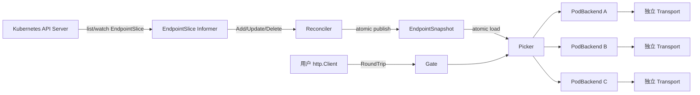

> [English](./technical-design.md) | 简体中文

# gokubegate 技术设计

## 文档状态

- 状态：Draft v0.1
- 日期：2026-08-29
- 范围：gokubegate v0.1 核心库（集群内客户端负载均衡）
- 本文是技术设计，不代表功能已经实现

## 1. 背景与动机

Kubernetes Service 的 ClusterIP 负载均衡是 L4 级别的：**只在 TCP 建连时选择一个 endpoint**。Go 的 `net/http.Transport` 会优先复用已有 keep-alive 连接，因此从集群内 Go 服务访问另一个服务时，请求会长期集中在少数 Pod 上。HTTP/2 的单连接多路复用会进一步放大这种连接级粘连。

这类连接级粘连问题曾在生产网关中导致转发超时。此前团队验证的一系列缓解手段：

- 扩大连接池、延长 idle timeout、降低 buffer —— 缓解建连压力；
- 低比例随机 `Connection: close` 轮换 —— 缓解旧 endpoint 粘连。

这些手段都只是**改善概率分布**，无法保证按请求在当前 Ready Pod 之间负载均衡。最终采用的方案是客户端侧基于 `EndpointSlice` 的按 Pod 负载均衡：请求前先选 Pod，直接拨 Pod 地址，每 Pod 维护独立连接池。

**gokubegate 的目标是把这套已验证的能力抽成一个通用的、开箱即用的 Go 客户端库**，任何运行在集群内的 Go 服务都可以通过几行代码获得客户端级别的负载均衡，而不需要理解 informer、连接池、drain 等细节。

## 2. 目标

1. 暴露极简 API：`gokubegate.NewClient(ctx, namespace, service, opts...)`，返回即可用的 `*http.Client` 包装。
2. 自动完成：EndpointSlice 发现、Ready/terminating 过滤、客户端负载均衡、每 Pod 独立连接池、Pod 增删摘除。
3. 与标准库 `net/http` 完全兼容（核心是 `http.RoundTripper`），普通请求、SSE 流式、长请求都可用。
4. 默认零配置开箱即用；必要的定制全部通过可选参数（functional options）提供。
5. 优雅生命周期：启动时等待 informer cache sync，关闭时优雅 drain 在途请求。
6. Kubernetes API Server 短暂不可用时，继续用 last-known-good 快照转发，不中断业务。
7. 可观测：事件 Hook 机制，由使用方自行实现指标/追踪/审计；默认零采集、零日志依赖。
8. 一个 `Client` 对应一个下游 Service；多服务场景由用户组合多个 `Client`，不搞隐式聚合。

## 3. 非目标（v0.1 不包含）

- **不做跨 Pod 自动重试**：POST 等请求不可安全重放，自动重试会产生重复写入和故障放大；仅保留 `net/http.Transport` 自身对安全条件的有限重试。
- 不做自适应权重、EWMA、熔断或复杂异常实例驱逐。
- 不启用 HTTP/2 多路复用；但架构必须兼容未来按 Pod 启用 HTTP/2。
- 不处理 Service Mesh mTLS/sidecar 的接入细节（文档给出约束与提示）。
- 不替代 Kubernetes readiness probe，不自己实现健康检查。
- 不要求无重启热切换配置（改配置 + 滚动发布即可）。

## 4. 设计原则

- **借鉴 gRPC Resolver/Picker 的职责边界**：发现（Resolver）、连接（SubConn/Transport）、请求选择（Picker）三层解耦。
- **请求热路径零锁**：快照用 `atomic.Pointer` 发布，Picker 只读快照，不访问 informer cache、不持有锁。
- **每 Pod 独立 transport**：摘除时可定向 `CloseIdleConnections`，不与其他 Pod 争抢全局连接配额，天然兼容未来 HTTP/2。
- **默认安全**：配置错误启动即失败；空 endpoint 返回明确错误，不静默 fallback 到 Service DNS。
- **易用优先**：能自动解析的（端口、集群配置）就不让用户配置；接口先给默认值，再给扩展点。

## 5. 快速上手

### 5.1 最简用法（集群内）

```go
package main

import (
    "context"
    "net/http"

    "github.com/your-org/gokubegate"
)

func main() {
    ctx := context.Background()

    // 一行创建：自动 InClusterConfig、自动解析端口、默认 round-robin。
    client, err := gokubegate.NewClient(ctx, "demo", "demo-chat")
    if err != nil {
        panic(err) // 配置错误 / RBAC 缺失 / cache sync 超时都会在这里暴露
    }
    defer client.Close() // 优雅 drain 在途请求并停止 informer

    req, _ := http.NewRequestWithContext(ctx, http.MethodGet,
        "http://demo-chat.demo.svc.cluster.local:8888/demo/v2/chat/status", nil)
    resp, err := client.Do(req) // 请求会被自动分发到某个 Ready Pod
    if err != nil {
        panic(err)
    }
    defer resp.Body.Close()
    _ = resp
}
```

> `client` 内嵌 `*http.Client`，`Get/Post/Do` 等方法直接可用。

### 5.2 需要定制时

```go
client, err := gokubegate.NewClient(ctx, "demo", "demo-chat",
    gokubegate.WithPort(8888),                           // 显式端口，跳过 Service 查询
    gokubegate.WithStrategy(gokubegate.StrategyRandom),  // 默认 RoundRobin
    gokubegate.WithCacheSyncTimeout(30*time.Second),
    gokubegate.WithLogger(slog.Default()),
)
```

### 5.3 高级用法：自己组合 http.Client

```go
// 拿裸 RoundTripper，多个 http.Client 共享同一 Gate 和连接池。
gate, err := gokubegate.NewGate(ctx, "demo", "demo-chat")
if err != nil {
    panic(err)
}
defer gate.Close()

short := &http.Client{Transport: gate, Timeout: 10 * time.Second}  // 普通请求
stream := &http.Client{Transport: gate, Timeout: 0}                // SSE 流式，无全局超时
```

关键点：`http.Client.Timeout` 是 client 层的，`RoundTripper` 只管连接与分发，因此**同一个 Gate 可以被不同超时语义的多个 http.Client 共享**，这正是内部网关中 normal/admin/SSE 三类 profile 的通用化替代，无需为每类请求复制连接池。

### 5.4 所需 RBAC（文档给使用者）

```yaml
apiVersion: rbac.authorization.k8s.io/v1
kind: Role
metadata:
  name: gokubegate-endpointslice-reader
  namespace: demo
rules:
  - apiGroups: ["discovery.k8s.io"]
    resources: ["endpointslices"]
    verbs: ["get", "list", "watch"]
  - apiGroups: [""]
    resources: ["services"]   # 仅当未显式 WithPort、需要自动解析端口时
    verbs: ["get"]
---
apiVersion: rbac.authorization.k8s.io/v1
kind: RoleBinding
metadata:
  name: gokubegate-endpointslice-reader
  namespace: demo
subjects:
  - kind: ServiceAccount
    name: <你的应用 ServiceAccount>
    namespace: demo
roleRef:
  apiGroup: rbac.authorization.k8s.io
  kind: Role
  name: gokubegate-endpointslice-reader
```

## 6. 总体架构



核心约束：

- informer/reconciler 与请求热路径完全隔离；请求只读快照。
- 每 Pod 一个 `PodBackend`（含独立 transport），连接不跨 Pod 复用。
- 请求不经过 Service ClusterIP，直接拨 Pod IP；逻辑 Host 保持不变。
- 没有 Pod 可用时 `RoundTrip` 返回类型化错误 `ErrNoEndpoints`，绝不静默降级。

## 7. 核心组件设计

### 7.1 Discovery（发现）

- 默认使用 `rest.InClusterConfig()`；提供 `WithRESTConfig` / `WithKubeConfig` 支持本地调试与测试。
- 用 `client-go` 的 `SharedInformerFactory` 只 watch `discovery.k8s.io/v1 EndpointSlice`，以 `kubernetes.io/service-name=<service>` label 过滤。
- 端口解析优先级：
  1. `WithPort(n)` 显式端口；
  2. `WithPortName(name)`：启动时 GET 一次 Service，按 port name 解析；
  3. 默认：启动时 GET 一次 Service，取第一个 TCP 端口。
  - 端口解析同时充当 Service 存在性校验；显式 `WithPort` 时跳过 Service 查询（用户已断言）。
- 端点聚合规则（每次 reconcile 合并该 Service 的全部 EndpointSlice）：
  - 入选条件：`ready != false AND terminating != true`（nil 遵循 K8s 语义：`ready==nil` 视为 true，`terminating==nil` 视为 false）；
  - 端口：匹配配置端口且协议为 TCP 或 nil；缺失/冲突则忽略该 endpoint 并记录指标；
  - 地址：支持 IPv4/IPv6（`net.JoinHostPort`）；第一阶段忽略 FQDN address type；
  - 一个 endpoint 含多个地址时，每个地址作为独立 backend；
  - backend key：`namespace/service/targetRef.uid/address/port`，UID 缺失时退化为 `namespace/service/address/port`。

### 7.2 EndpointSnapshot（不可变快照）

```go
type EndpointSnapshot struct {
    Version  uint64
    Backends []*PodBackend
    Updated  time.Time
}
```

- 通过 `atomic.Pointer[EndpointSnapshot]` 发布与读取。
- 请求路径**禁止**直接读 informer cache，避免 K8s 对象锁和聚合开销进入热路径。
- 发布前按 backend key 稳定排序，保证测试可重复、round-robin 行为可预期。

### 7.3 Picker（负载均衡策略）

```go
type Strategy interface {
    Pick(backends []*PodBackend) *PodBackend
}
```

- `StrategyRoundRobin`（默认）：每个 Client 独立原子计数器，`index := counter.Add(1)`，`backend := backends[index%len(backends)]`；计数器初始值用进程内随机偏移，避免多个副本同时冲击同一 Pod。
- `StrategyRandom`：`rand.IntN`。
- 策略接口开放，后续可加 P2C / least-request（需先定义 SSE、长请求、短请求各自的"负载"语义）。
- Picker 只读快照，不执行 DNS、锁等待或健康检查。

### 7.4 PodBackend（每 Pod 连接池）

```go
type PodBackend struct {
    Key       EndpointKey
    Address   string
    PodName   string
    NodeName  string

    transport *http.Transport
    inflight  atomic.Int64
    draining  atomic.Bool
}
```

- **单 transport profile**（区别于内部网关常见的 normal/admin/SSE 三 profile）：client 级超时由用户的 `http.Client` 决定，transport 只需管理连接；同一 Gate 可被多个超时语义不同的 client 共享（见 5.3）。这是通用库相对内部网关的简化与泛化。
- transport 参数（默认值，均可通过选项覆盖）：
  - `MaxIdleConns` / `MaxIdleConnsPerHost`：`maxIdleConnsPerPod`（默认 32），两值设为相同；
  - `IdleConnTimeout`：90s；`DialContext.Timeout`：5s；`TCPKeepAlive`：30s；
  - `ResponseHeaderTimeout`：15s（SSE 也适用，只影响首个响应头等待）；
  - `MaxConnsPerHost`：0（不设硬上限，避免客户端隐式排队等待）；
  - `ForceAttemptHTTP2`：false（见 8.4）。
- **连接预算**（文档约束使用者）：`下游 Pod 数 × 每 Pod idle 上限 × 使用该库的副本数`，默认值 32 是安全起点，需按峰值并发压测确定：`maxIdleConnsPerPod >= 每 Pod 峰值 RPS × 下游 P99 秒数 × 1.5~2`。
- 不按请求创建 transport；transport 与 PodBackend 同生命周期。

### 7.5 Gate（http.RoundTripper）

`Gate` 实现 `RoundTrip(req *http.Request) (*http.Response, error)`，流程：

1. `atomic.Load` 当前快照；为空返回 `ErrNoEndpoints`；
2. Picker 选择一个 backend；
3. `backend.inflight.Add(1)`；
4. 克隆请求（浅拷贝 + 克隆 URL），按 8.1 规则改写 URL/Host；
5. `backend.transport.RoundTrip(req)`；
6. 成功：包装 `resp.Body`，在首次 `Close` 时 `inflight.Add(-1)`（幂等）；失败且无 response：立即 `inflight.Add(-1)`；
7. 发出事件（`endpoint_picked`、`request_done`）。

并发安全：Gate 可被多个 goroutine / 多个 http.Client 并发使用。

### 7.6 Client（易用封装）

```go
type Client struct {
    *http.Client
    gate *Gate
}

func (c *Client) Close() error          // 停 informer → drain 全部 backend → 释放
func (c *Client) Endpoints() []EndpointInfo // 当前快照（调试/观测）
func (c *Client) Mode() string          // "pod" 或 "clusterip"
```

`NewClient` 阻塞直到 informer cache sync（默认 20s，可配），保证返回的 client 立即可用；失败返回明确错误（配置、RBAC、超时）。

## 8. 请求改写规则

### 8.1 URL / Host

```text
用户构造: http://demo-chat.demo.svc.cluster.local:8888/demo/v2/chat/status
实际拨号: http://10.0.1.23:8888/demo/v2/chat/status
HTTP Host: demo-chat.demo.svc.cluster.local:8888
```

规则：

1. 克隆请求，不原地修改；
2. `req.URL.Scheme` 保留逻辑 scheme（空则用 `WithScheme`，默认 http）；
3. `req.URL.Host` 改为选中 Pod 的 `host:port`；
4. `req.Host` 显式设置为逻辑 Service authority（`<service>.<namespace>.svc.<clusterDomain>`，默认 `cluster.local`，可用 `WithClusterDomain` 覆盖）；若用户已显式设置 `req.Host` 则尊重用户值；
5. path / raw path / query 保持不变；
6. 继续传播用户设置的 header（request ID 等由业务层负责）。

未来 HTTPS：TLS `ServerName` 使用逻辑 Service hostname 而非 Pod IP，证书必须覆盖 Service hostname。

### 8.2 为什么不直接用 Service DNS

Service DNS 的负载均衡发生在 TCP 建连时；复用 keep-alive 后请求不再重新分配。直接拨 Pod IP 才能做到**按请求**均衡，这也是本库的核心价值。

### 8.3 空 endpoint / 失败

- 空快照：`RoundTrip` 返回 `ErrNoEndpoints`（`errors.Is` 可判断），快速失败，不 fallback、不重试。
- 单个 backend 拨号失败：错误返回给调用方，由调用方决定重试（见 10.4）。

### 8.4 HTTP/2

v0.1 不启用 HTTP/2（`ForceAttemptHTTP2: false`）。原因同内部网关设计：L4 模式下 HTTP/2 长连接多路复用会把流量粘在少数 endpoint。每 Pod 独立 transport 的架构已为"按 Pod 启用 HTTP/2"留好隔离边界；将来接入能按请求重新均衡的机制（如 Service Mesh 或明确端到端 HTTP/2）时再评估。

## 9. 生命周期

### 9.1 启动

1. 创建 REST config（InClusterConfig 或显式注入）；
2. 创建 clientset + SharedInformerFactory（仅 EndpointSlice informer；需要端口解析时额外 GET 一次 Service，不 watch）；
3. 启动 informer，等待 cache sync，超时（默认 20s）则返回错误；
4. 初始化快照、Picker、Gate；
5. `NewClient` 返回可用 client。

### 9.2 运行期 reconcile

- informer 事件回调只把对应 Service 入队，不做阻塞操作；
- reconcile 串行执行：读 informer cache → 计算新 backend 集合 → 复用未变化 backend、创建新增 backend、标记删除 backend → 原子发布新快照 → 异步 drain 被摘除的 backend；
- 新增 backend 不预热（避免扩容惊群），第一条请求按需建连。

### 9.3 摘除与 drain

endpoint NotReady / terminating / 从 EndpointSlice 消失时：

1. 从新快照移除，立即停止接收新请求；
2. `draining = true`；
3. `transport.CloseIdleConnections()`；
4. 在途请求继续执行，不主动打断 active 连接；
5. 等待 `inflight == 0` 或达到 `drainTimeoutSeconds`（默认 30s，可配）；
6. 再次 `CloseIdleConnections()`（处理摘除时仍 active、随后回到 idle pool 的连接）并从 registry 删除引用；
7. 达到 drain 超时仍不打断业务请求，对象保留到 inflight 归零并记录超时指标。

### 9.4 Close（优雅关闭）

1. 停止 informer（stop channel）；
2. 对全部 backend 执行 drain（同 9.3）；
3. 关闭并释放资源；
4. `Close` 幂等，可多次调用。

## 10. 失败处理

### 10.1 启动失败（fail fast）

以下情况 `NewClient`/`NewGate` 返回错误：

- 无法创建 in-cluster REST config（且未显式注入）；
- EndpointSlice informer 首次 cache sync 超时；
- 配置不完整（namespace/service 为空）、端口非法；
- RBAC 导致 list/watch 被拒绝。

发布系统能据此明确发现配置或权限错误，而不是静默降级。

### 10.2 API Server 短暂不可用

informer 完成首次同步后 list/watch 断开：

- 继续使用 last-known-good 快照转发；
- informer 自动重连；
- 指标暴露距上次成功同步的时间与 watch 错误；
- **不**自动切换回 Service DNS。

### 10.3 空 endpoint

- 首次同步成功但服务无可用 endpoint：`ErrNoEndpoints`；
- 运行中收到权威空集合：同样快速失败，不选择 NotReady/terminating endpoint，不 fallback。

### 10.4 请求失败与重试

- v0.1 不增加跨 Pod 重试：body 不保证可重放；
- 保留 `net/http.Transport` 对安全条件请求的有限重试；
- 若未来增加跨 Pod retry，必须同时满足：方法幂等或带 idempotency key、`Request.GetBody` 可重放、能判断失败发生在安全阶段、重试次数与总 deadline 硬上限、重试排除刚失败的 endpoint。

## 11. 可观测性

### 11.1 设计原则：Hook 事件，默认零采集

核心库**不内置指标实现，也不依赖任何 metrics 库**。可观测能力通过事件 Hook 暴露，由使用方自行实现指标、追踪或审计，类似 `slog.Logger`：默认无输出，按需注入。

```go
// Hook 接收 gokubegate 运行时事件；实现必须快速返回，不得阻塞请求路径。
type Hook interface {
    Handle(Event)
}

type Event struct {
    Kind     EventKind
    Service  string        // 目标服务
    Endpoint string        // 短标签（Pod 名或地址 hash）
    Ready    int           // endpoints_updated：Ready 数量
    Draining int           // endpoints_updated：draining 数量
    Result   string        // 结果：success/error/completed/timeout
    Reused   bool          // request_done：连接是否复用
    Err      error         // reconcile 失败原因
    Duration time.Duration // request_done：往返耗时
}
```

事件类型：

| EventKind | 触发时机 | 主要字段 |
| --- | --- | --- |
| `endpoints_updated` | 快照 reconcile 后 | Ready, Draining |
| `endpoint_picked` | 每次请求选择 endpoint 后 | Endpoint |
| `request_done` | 请求完成（响应或错误） | Endpoint, Result, Reused, Duration |
| `reconcile` | 每次 reconcile 尝试 | Result, Err |
| `endpoint_drained` | 摘除的 endpoint drain 完成/超时 | Endpoint, Result |

注册方式：

```go
client, err := gokubegate.NewClient(ctx, "demo", "demo-chat",
    gokubegate.WithHook(prometheusHook),      // 可注册多个
    gokubegate.WithHook(auditHook),
)
```

默认无任何 Hook（零开销）；`WithHooks(...)` 可一次注册多个。Hook 按注册顺序同步调用，实现方不要把耗时操作放进 `Handle`。

### 11.2 日志

- 默认**不输出任何日志**（discard handler）；
- `WithLogger(*slog.Logger)` 注入自己的 logger；
- `WithDebug()` 开启内部 debug 日志（写 stderr）。

### 11.3 使用方实现示例（Prometheus）

库本身不提供 Prometheus 适配；下面是一段基于 Hook 的最小实现思路（M2 会在 `examples/` 提供完整示例）：

```go
type promHook struct{ requests *prometheus.CounterVec }

func (h *promHook) Handle(e gokubegate.Event) {
    switch e.Kind {
    case gokubegate.EventRequestDone:
        h.requests.WithLabelValues(e.Service, e.Endpoint, e.Result).Inc()
    case gokubegate.EventEndpointsUpdated:
        h.endpoints.WithLabelValues(e.Service, "ready").Set(float64(e.Ready))
    }
}
```

- `endpoint` 标签用短 Pod 名或稳定短 hash，基数上限 ≈ 滚动窗口内 Pod 数；
- 正常请求不写日志，只发事件；事件不含用户数据与 bearer token。

## 12. 安全与网络约束

- 仅需目标 namespace 的 EndpointSlice 只读权限（+ 可选 Services get）；不给 Pod/Secret/ConfigMap 权限；
- NetworkPolicy 必须允许本应用直连下游 Pod CIDR 和目标端口；
- 若集群使用 Service Mesh sidecar，需确认 Pod IP 直连仍经过预期 mTLS/sidecar 路径；未确认前不建议启用；
- 日志与指标不记录 bearer token。

## 13. 测试设计

### 13.1 单元测试（fake clientset）

- 端点聚合：多 EndpointSlice 合并、忽略其他 Service、`ready/terminating` 的 nil/true/false、IPv4/IPv6、多端口、缺失端口、UID 复用 IP；
- Picker：N 个 endpoint 的 round-robin 分布、随机初始偏移、空快照、draining 不被选中；
- Backend：同 endpoint 复用 transport、不同 endpoint 不共享、Body Close 后 inflight 幂等递减、drain 不打断 active 请求；
- Gate：请求改写（URL.Host、req.Host、query 保留）、`ErrNoEndpoints`；
- 并发：`go test -race` 覆盖并发请求 + 快照替换。

### 13.2 集成测试（envtest / kind）

- 多副本测试服务返回自身 identity，验证：短请求下各 endpoint pick 数差值 ≤ 1；连接复用；扩容后新 Pod 开始接流量；缩容/NotReady 后停止接流量且在途完成；API Server 抖动时 last-known-good。
- 持续并发：单个长生命周期 Client 在 64 并发下每 2 秒执行一次 `2→8→2→6→1→4`，按秒记录请求数、错误率和 p95，禁止完整秒级全断；
- SSE：20 条并发长流逐事件校验 Pod identity，一条流内不得切换 Pod，新流在 Ready Pod 间均衡；
- 控制面故障：持续流量期间暂停 kind control-plane 5 秒，验证 last-known-good 快照零错误转发；
- 并发梯度：1/8/32/64 worker 分别记录吞吐、连接复用率和 p50/p95/p99/max。

### 13.3 性能与稳定性

- 目标峰值 2 倍压测；记录各 Pod RPS、P50/P90/P99、复用率、新建连接速率；
- 扩缩容 2N / N/2、上游与下游同时滚动发布；
- 统计 FD、goroutine、heap、总 idle 连接，验证连接预算。

## 14. 代码组织（规划）

```text
gokubegate/
  client.go       // Client 封装（NewClient、Close、Endpoints）
  gate.go         // Gate：http.RoundTripper、请求改写
  discovery.go    // EndpointSlice informer + reconciler + 端口解析
  snapshot.go     // EndpointSnapshot、EndpointKey
  picker.go       // Strategy 接口 + RoundRobin/Random
  backend.go      // PodBackend、transport、drain
  options.go      // 全部 functional options 与默认值
  hooks.go        // Hook 接口 + Event 类型
  errors.go       // ErrNoEndpoints 等类型化错误
  *_test.go
```

## 15. 里程碑

- **M1（核心可用）**：上述包 + 单测；`NewClient`/`NewGate` 可用；默认配置通过；RBAC 文档。
- **M2（示例与集成）**：基于 Hook 的 Prometheus 示例（`examples/`）；envtest/kind 集成测试；扩缩容用例。
- **M3（发布）**：压测定容量；README 与示例完善；打 tag 发布 v0.1。

## 16. 待实施前确认项

1. 目标 K8s 版本范围（决定 client-go 版本与 informer API）；
2. `go.mod` Go 版本与依赖策略（client-go 版本 pinning）；
3. 是否需要支持多 Service 单 Client（v0.2 再评估 `NewMultiClient`）；
4. 是否需要在库内提供 Service DNS 回退模式开关（默认不开，文档说明风险）；
5. 开源协议选择（建议 Apache-2.0）。

## 17. ClusterIP 模式

除直接发现并选择 Pod 的 `pod` 模式外，当前实现提供并列的 **`clusterip` 模式**。
该模式复用单个 `http.Transport` / 连接池，仍然
访问 Kubernetes Service DNS/ClusterIP，不直接拨 Pod IP；通过低比例随机设置
`http.Request.Close = true`，让承载本次普通 HTTP 请求的连接在响应完成后退出连接池，促使后续
新连接由 Kubernetes L4 Service 重新选择 endpoint。

该模式复刻内部网关已验证的连接轮换语义，并与 `pod` 模式保持清晰边界：

- `pod`：EndpointSlice + 请求级 Picker + 每 Pod 独立 Transport，提供确定性的 Ready Pod 分发；
- `clusterip`：单一共享 Transport + Service 地址 + 概率性连接轮换，只改善长连接粘连，
  不承诺请求级精确均衡；
- 配置使用采样分母表达：`0` 表示关闭，默认 `1000` 表示约 0.1% 请求设置 `req.Close`；非零值
  最低为 100，避免过高轮换率造成连接风暴；
- 只对普通、可在有限时间内完成响应的 HTTP 请求采样；带
  `Accept: text/event-stream` 的 SSE 请求不参与随机关闭；
- 必须保留用户显式 `req.Close`，并保证不修改调用方原始 Request（clone 后再设置）；
- 提供 `EventConnectionRotated` Hook 事件，并让 `Client.Mode()` 返回实际模式；
- API 使用 `ModePod`、`ModeClusterIP`、`WithMode(...)` 和
  `WithConnectionCloseSampleDenominator(...)`，默认仍为 `pod`，已有行为不变；
- 未显式配置 `WithPort` 时，只读取 Service 解析 Service port，不启动 EndpointSlice informer；
  显式配置端口时不需要 Kubernetes API 权限。

真实集群串行 8000 请求对照结果：`pod` 为 2000/2000/2000/2000；关闭轮换的 `clusterip`
为 8000/0/0/0；默认 0.1% 轮换采样 10 次后覆盖四个 Pod，但分布为
5156/1624/830/390。结果验证了精确请求级均衡、L4 keep-alive 粘连和概率轮换三者的差异。

64 并发、每档 5 秒时，共享 Transport 会自然建立多条连接，因此两个模式都覆盖四个 Pod：
`pod` 四 Pod 差值仅 1；无轮换 `clusterip` 的最大最小差占总请求 0.58%；0.1% 轮换本次为
1.65%。低概率轮换在高并发短窗口不保证改善瞬时均匀度，其主要价值是让长生命周期连接池持续
更新，并在扩容后逐步建立映射到新 endpoint 的连接。

## 18. 参考资料

- [Kubernetes EndpointSlice API](https://kubernetes.io/docs/reference/kubernetes-api/discovery/endpoint-slice-v1/)
- [client-go SharedInformerFactory](https://github.com/kubernetes/client-go/blob/master/informers/factory.go)
- [Go net/http Transport](https://pkg.go.dev/net/http#Transport)
- [gRPC Custom Name Resolution](https://grpc.io/docs/guides/custom-name-resolution/)
- [Hertz 服务发现与负载均衡](https://www.cloudwego.io/docs/hertz/tutorials/framework-exten/service_discovery/)

